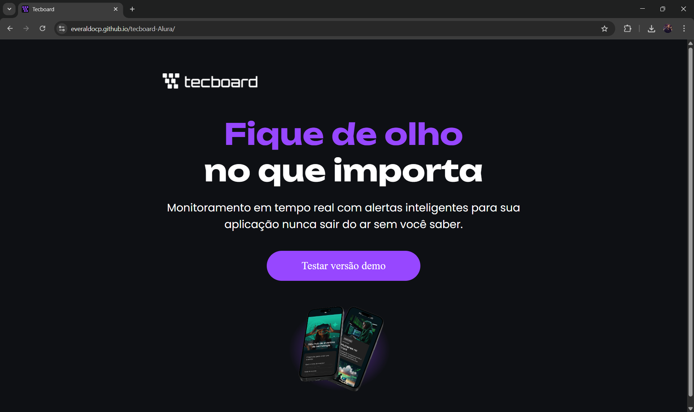

# Tecboard

Landing page desenvolvida como prática de HTML e CSS, simulando a apresentação de uma plataforma de monitoramento em tempo real.

## 📌 Sobre o projeto

Este projeto consiste na criação da interface inicial de um produto fictício chamado "Tecboard", com foco em apresentar uma solução de monitoramento de aplicações com alertas inteligentes.

A proposta foi trabalhar a estruturação semântica do HTML e a estilização com CSS, buscando um layout moderno, responsivo e visualmente agradável.

## 🚀 Tecnologias utilizadas

- HTML5
- CSS3

## 🎯 Aprendizados

Durante o desenvolvimento deste projeto, pratiquei:

- Estruturação de páginas com HTML semântico
- Estilização com CSS
- Organização de layout e hierarquia visual
- Uso de cores, tipografia e espaçamento
- Construção de uma interface inspirada em produtos reais

## 📷 Preview

# Tecboard

Landing page desenvolvida como prática de HTML e CSS, simulando a apresentação de uma plataforma de monitoramento em tempo real.

## 📌 Sobre o projeto

Este projeto consiste na criação da interface inicial de um produto fictício chamado "Tecboard", com foco em apresentar uma solução de monitoramento de aplicações com alertas inteligentes.

A proposta foi trabalhar a estruturação semântica do HTML e a estilização com CSS, buscando um layout moderno, responsivo e visualmente agradável.

## 🚀 Tecnologias utilizadas

- HTML5
- CSS3

## 🎯 Aprendizados

Durante o desenvolvimento deste projeto, pratiquei:

- Estruturação de páginas com HTML semântico
- Estilização com CSS
- Organização de layout e hierarquia visual
- Uso de cores, tipografia e espaçamento
- Construção de uma interface inspirada em produtos reais

## 📷 Preview

## 🔗 Acesse o projeto

Você pode visualizar o projeto aqui:
👉 https://everaldocp.github.io/tecboard-Alura/

---

Desenvolvido como parte dos estudos em desenvolvimento frontend.

## 🔗 Acesse o projeto

Você pode visualizar o projeto aqui:
👉 https://everaldocp.github.io/tecboard-Alura/

---

Desenvolvido como parte dos estudos em desenvolvimento frontend.
